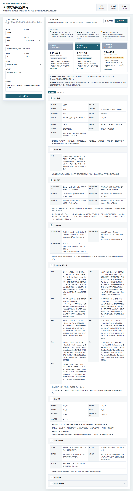
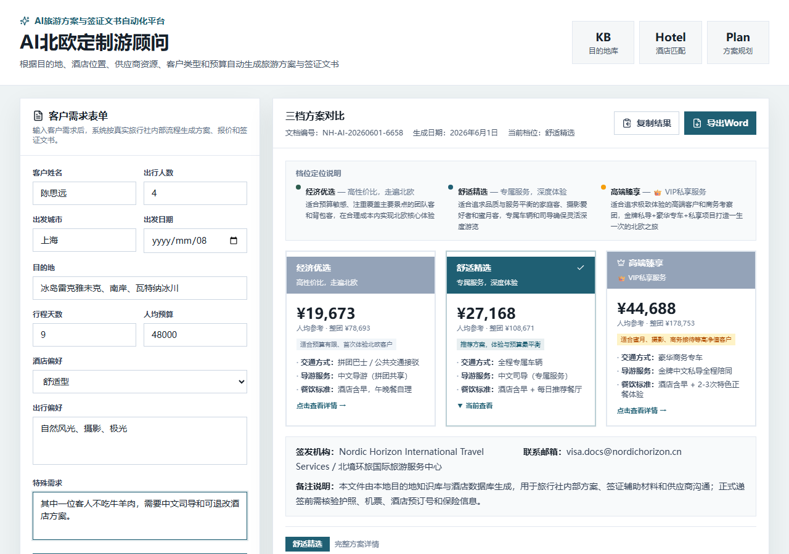
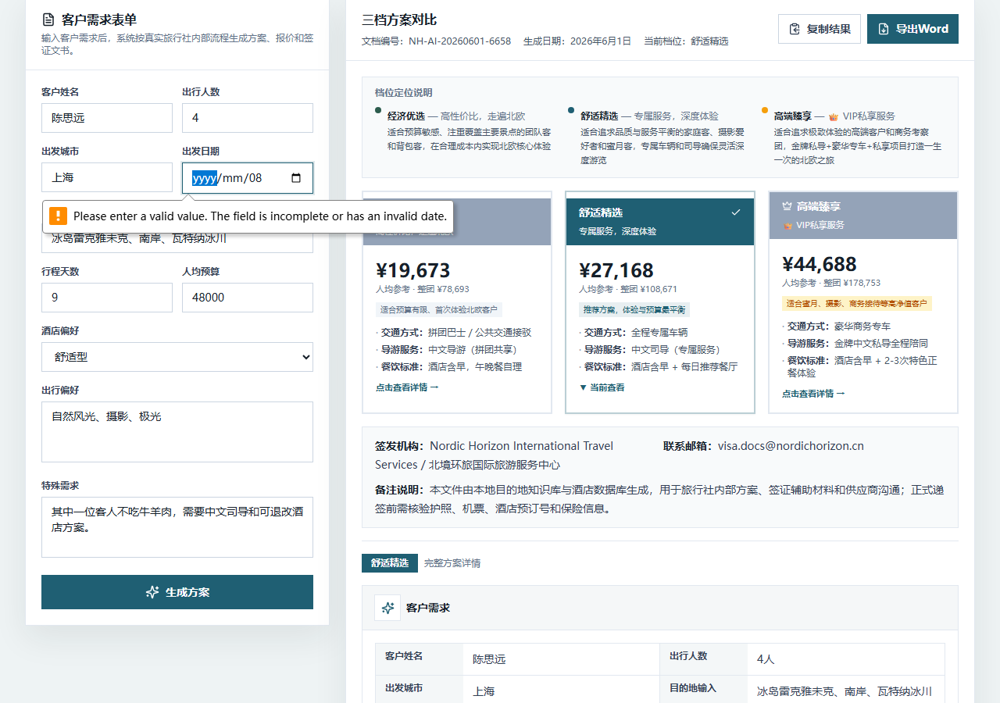
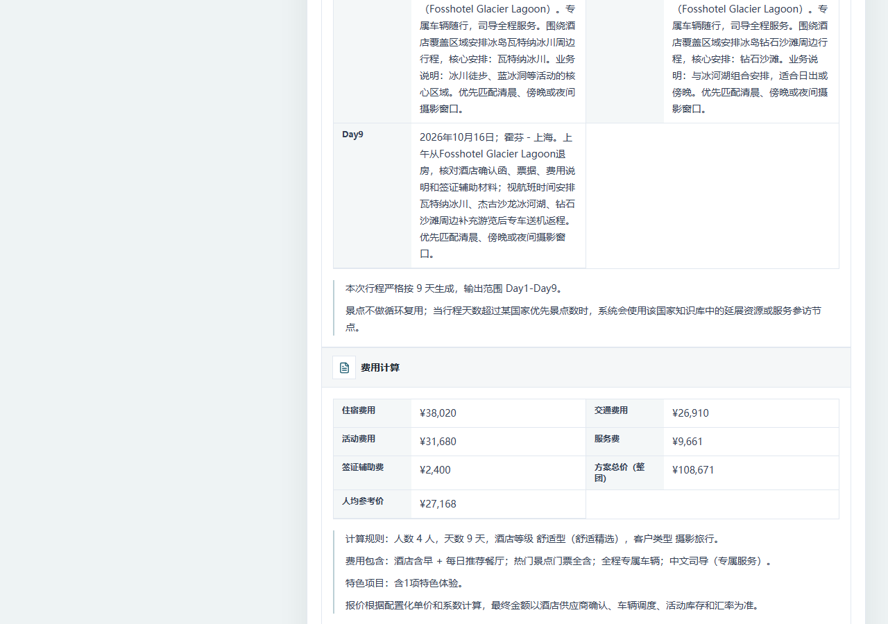
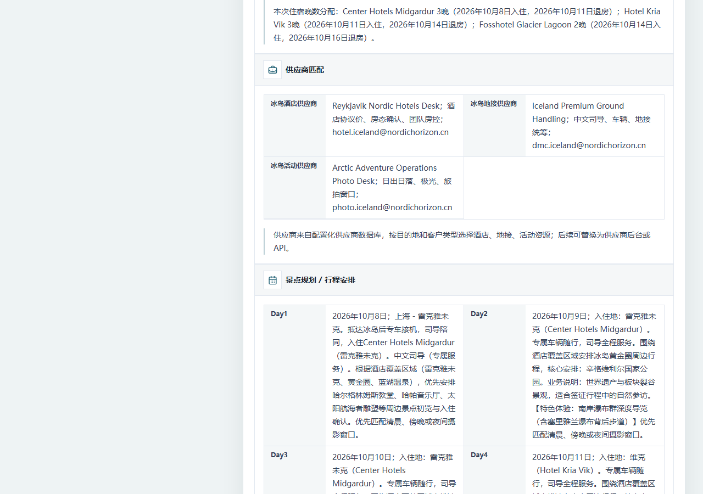
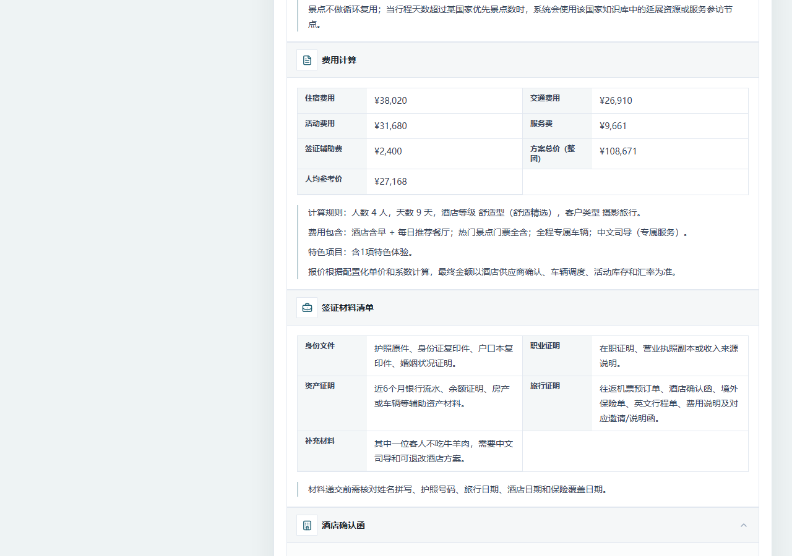

# AI北欧定制游顾问

利用 AI 自动生成北欧定制游方案、费用测算及签证辅助文书。

## 在线演示

[https://wang-peng-eng.github.io/ai-nordic-travel-advisor/](https://wang-peng-eng.github.io/ai-nordic-travel-advisor/)

## 项目背景

传统旅行顾问制作北欧定制游方案需要手动收集客户需求、匹配酒店资源、设计每日行程、整理签证材料，流程繁琐且依赖个人经验。

本项目通过 AI 自动化完成从需求采集到文书输出的全流程，将目的地知识库、酒店数据库、供应商资源和定价规则整合为可配置的生成引擎，一键输出三档方案及全套签证辅助文书。

## 核心功能

- **客户需求采集** — 姓名、人数、预算、偏好、特殊需求等结构化表单
- **客户类型识别** — 自动识别商务考察、亲子出游、蜜月旅行、摄影旅行、自然风光五类客户
- **北欧国家知识库匹配** — 覆盖冰岛、挪威、芬兰、瑞典、丹麦五个国家的景点、路线和特色资源
- **三档方案自动生成** — 经济优选、舒适精选、高端臻享三档并行输出
- **酒店推荐** — 按目的地、预算档位、客户类型智能匹配酒店及房型
- **行程生成** — 按日规划景点、酒店、特色体验，优先匹配酒店覆盖区域
- **费用测算** — 住宿、交通、活动、服务费、签证辅助费分项计算，含整团总价和人均参考价
- **酒店确认函生成** — 中英双语酒店预订确认函，用于签证申请
- **邀请函生成** — 根据客户类型（商务/亲子/蜜月/摄影）生成对应邀请/说明函
- **签证材料清单** — 自动生成身份、职业、资产、旅行证明分类清单

## 项目截图













## 技术栈

- [React](https://react.dev/) 19
- [Vite](https://vitejs.dev/) 7
- JavaScript (ES Modules)
- [Tailwind CSS](https://tailwindcss.com/) 3.4

## 项目结构

```
src/
  App.jsx              — 主应用组件（客户需求、方案生成、文书输出）
  config/
    travelData.js      — 目的地知识库、酒店数据库、供应商、定价规则
  index.css            — Tailwind 基础样式
  main.jsx             — 应用入口
scripts/
  run_case_tests.mjs   — 单档方案测试（Node.js VM）
  run_three_tier_tests.mjs — 三档方案测试
  generate_three_tier_report.py — Word 报告生成
  take_demo_screenshots.mjs — Playwright 截图脚本
```

## 测试验证

已完成 **5 组随机客户案例** 测试验证：

| 覆盖国家 | 客户类型 | 方案数量 |
|---------|---------|---------|
| 冰岛 | 摄影旅行 | 3 档 |
| 芬兰 | 亲子出游 | 3 档 |
| 挪威 | 商务考察 | 3 档 |
| 瑞典 | 蜜月旅行 | 3 档 |
| 丹麦 | 自然风光 | 3 档 |

共计生成 **15 套完整方案**，覆盖全部分档和客户类型。

## 本地运行

```bash
npm install
npm run dev
```

访问 `http://localhost:5173` 即可使用。
